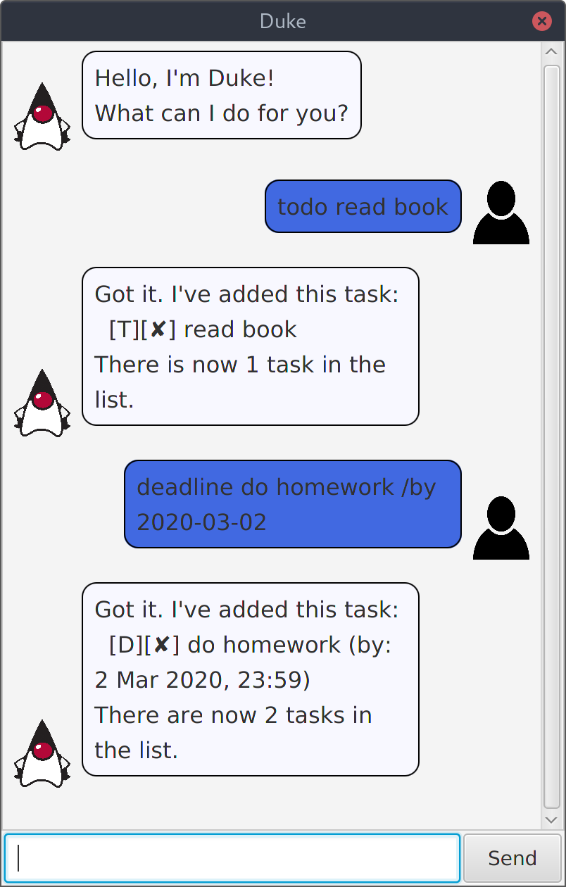

# User Guide

## 1 What is Duke?

Duke is a personal assistant chatbot that helps to keep track of various tasks. This user guide provides detailed instructions and examples on how you can use Duke to manage your tasks.

## 2 How to use Duke?

Duke can keep track of various tasks for you. In order to use Duke, you have to key in specific commands that it can understand. Here are the commands you can use:  
- [`todo`](#211-todo---adds-a-todo-item)  
- [`deadline`](#212-deadline---adds-a-deadline)  
- [`event`](#213-event---adds-an-event)  
- [`list`](#221-list---lists-tasks)  
- [`find`](#222-find---finds-tasks)  
- [`snooze`](#231-snooze---snoozes-a-task)  
- [`done`](#232-done---marks-a-task-as-done)  
- [`delete`](#233-delete---deletes-a-task)
- [`clear`](#241-clear---clears-the-list-of-tasks)
- [`bye`](#242-bye---exits-duke)

After you type a command in the text field at the bottom of the window, press "Enter" or click the "Send" button. Your command will then appear in a blue text bubble on the right, and Duke's response will appear in a white text bubble on the left.

In this user guide, your commands and Duke's responses (i.e. text that will appear in text bubbles) are indicated in monospaced font with a grey background. The details you need to provide are indicated with square brackets, and optional details are indicated with round brackets. For example, `deadline [description] /by [date] (time)` is a command where you have to provide the description and date, but providing the time is optional.

### 2.1 Adding a task

There are three types of tasks you can add:

- Todo: a task with a description
- Deadline: a task with a description and deadline
- Event: a task with a description and time

#### 2.1.1 `todo` - Adds a todo item

This command adds a todo item to your list.

Usage:  
`todo [description]`

Example:  
`todo read book`

Expected outcome:  
`Got it. I've added this task:`  
&#8203;`  [T][✗] read book`  
`There is now 1 task in the list.`

#### 2.1.2 `deadline` - Adds a deadline

This command adds a deadline to your list.

Usage:  
`deadline [description] /by [date] (time)`  
The date has to be in YYYY-MM-DD format, and the time has to be in HH:mm format.
If you do not indicate the time, it will be set to 23:59 by default.

Example:  
`deadline do homework /by 2020-06-30 17:00`

Expected outcome:  
`Got it. I've added this task:`  
&#8203;`  [D][✗] do homework (by: 30 Jun 2020, 17:00)`  
`There are now 2 tasks in the list.`

#### 2.1.3 `event` - Adds an event

This command adds an event to your list.

Usage:  
`event [description] /at [date] [time]`  
The date has to be in YYYY-MM-DD format, and the time has to be in HH:mm format.

Example:  
`event project meeting /at 2020-03-15 15:00`

Expected outcome:  
`Got it. I've added this task:`  
&#8203;`  [E][✗] project meeting (at: 15 March, 15:00)`  
`There are now 3 tasks in the list.`

### 2.2 Viewing tasks

#### 2.2.1 `list` - Lists tasks

This command lists all the tasks that you have added.

Usage:  
`list`

Expected outcome:  
`1. [T][✗] read book`  
`2. [D][✗] do homework (by: 30 Jun 2020)`  
`3. [E][✗] project meeting (at: 15 March, 15:00)`

#### 2.2.2 `find` - Finds tasks

This command lists for all tasks whose descriptions contain the search term you specify.

Usage:  
`find [search term]`

Example:  
`find book`

Expected outcome:  
`Here are the matching tasks in your list:`  
`1. [T][✗] read book`

### 2.3 Editing tasks

#### 2.3.1 `snooze` - Snoozes a task

This command postpones of a task. Only deadlines can be snoozed.

Usage:  
`snooze [task number] [duration]`

Example:  
`snooze 2 1 day`

Expected outcome:  
`Noted. Here's the updated task:`  
&#8203;`  [D][✗] do homework (by: 1 Jul 2020, 17:00)`

#### 2.3.2 `done` - Marks a task as done

This command marks a task as completed.

Usage:  
`done [task number]`

Example:  
`done 3`

Expected outcome:  
`Nice! I've marked this task as done:`  
&#8203;`  [E][✓] project meeting (by: Monday 3pm)`

#### 2.3.3 `delete` - Deletes a task

This command removes a task from your list of tasks.

Usage:  
`delete [task number]`

Example:  
`delete 1`

Expected outcome:  
`Noted. I've removed this task:`  
&#8203;`  [T][✗] read book`

### 2.4 Miscellaneous

#### 2.4.1 `clear` - Clears the list of tasks

This command removes all your tasks from your list.

Usage:  
`clear`

Expected outcome:  
`Noted. I've removed all the tasks in your list.`  

#### 2.4.2 `bye` - Exits Duke

This command exits the Duke program.

Usage:  
`bye`

Expected outcome:  
The program ends and the window disappears.
